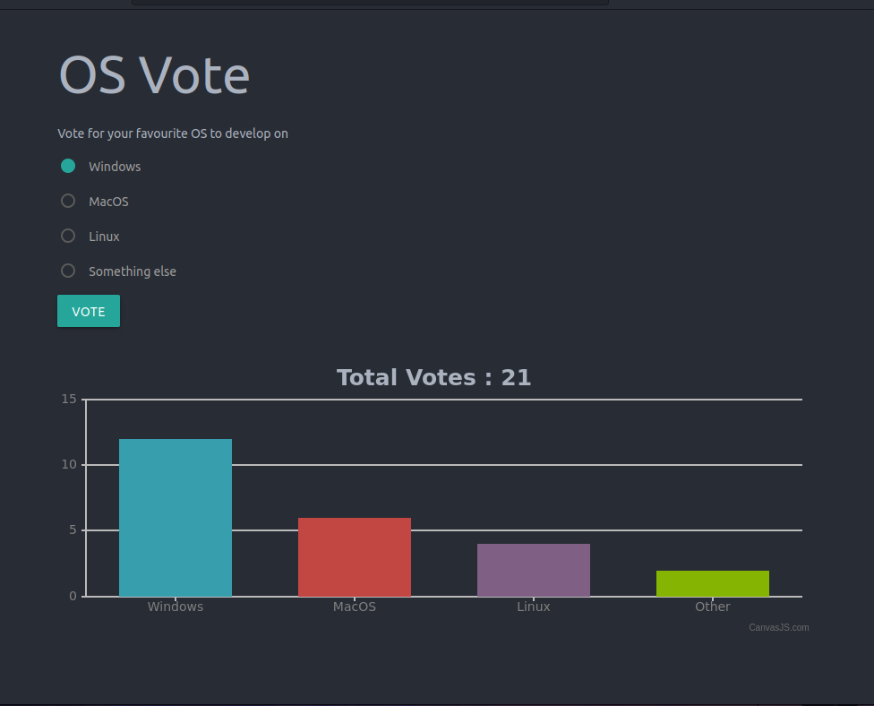

## General info
___
> This is a real time polling app using Node.js, Express, Pusher, MongoDB and CanvasJS

## Quick start
___

```powershell
# Install dependencies
npm install

# Run dev server localhost:3000
npm run dev

# Start
npm start
# localhost:3000/poll to view the DB json
```
## Image
___



## Tech stack
___

#NodeJS 
#Express 
#Pusher 
#MongoDB 
#CanvasJS


## My Github
___

| Name            | Github                                        |
| --------------- | --------------------------------------------- |
| Josip Čondić  | [GitHub](https://github.com/ararune)|
